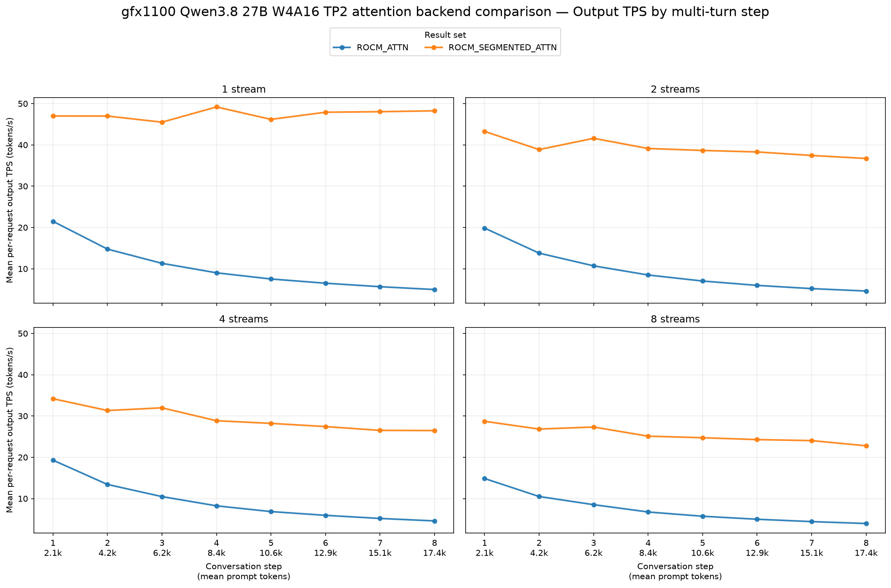
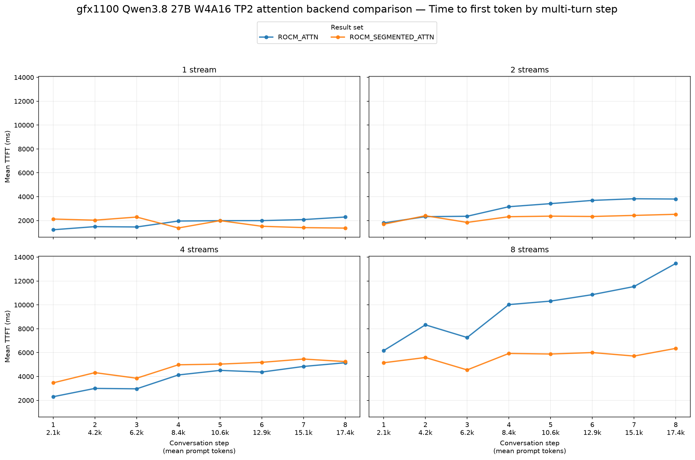
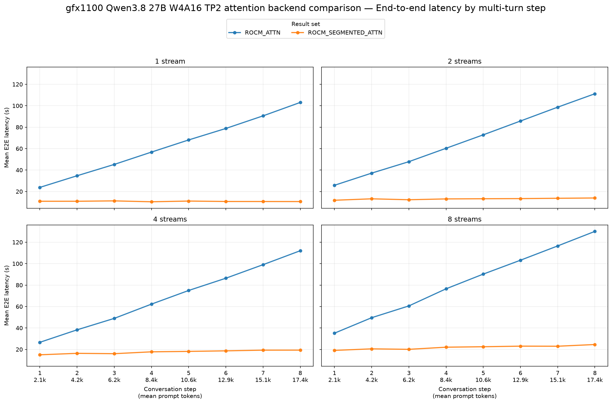

# gfx1100: ROCM_SEGMENTED_ATTN vs ROCM_ATTN

## Setup and compatibility

- Hardware: two AMD Radeon RX 7900 XTX (`gfx1100`, 24 GiB each), tensor parallel size 2.
- Model: `dbirks/Qwen3.8-27B-W4A16-AutoRound` on the same vLLM fork checkout (`4f208193293dde825c367f760559ba0faa727cfb`) and ROCm 10 Pixi environment.
- Both servers used the workspace's `serve-qwen3.8-27b-w4a16.bash` settings: `--max-num-seqs 8`, `--gpu-memory-utilization 0.9`, `--max-num-batched-tokens 8192`, `--max-model-len auto`, tool and reasoning parsers, multimodal encoder TP mode, and fastsafetensors loading. Only `--attention-backend` changed. The segmented backend used its default startup autotuning.
- GuideLLM 0.7.3 ran [`simple-agent-multiturn-prefix-cache.json`](../../../../benchmarks-configs/simple-agent-multiturn-prefix-cache.json): seed `20260715`, eight turns, 2,048 synthetic prompt tokens added per turn, 512 output tokens per request, and configured streams 1/2/4/8 with request budgets 8/16/32/64. Both runs used the same backend target and workload configuration.
- Each report has 8/16/32/64 successful requests, with zero errored or incomplete requests. Every successful response has 512 output tokens. Generated reply text changes the exact tokenized prompt length on later turns, so the prompt distributions are similar but not identical.
- Baseline: [`ROCM_ATTN` result](../../../../results/gfx1100/qwen3.8-27b-w4a16/tp2-rocm-attn/agent-multiturn-benchmarks.json). Candidate: [`ROCM_SEGMENTED_ATTN` result](../../../../results/gfx1100/qwen3.8-27b-w4a16/tp2-rocm-segmented-attn/agent-multiturn-benchmarks.json).

The table and plots use arithmetic means across **all successful request records** in each stream case. Positive output TPS changes and negative TTFT or end-to-end (E2E) latency changes improve performance. These are end-to-end serving measurements, not attention kernel microbenchmarks.

| Streams | Output tok/s, baseline → candidate | Output tok/s change | Mean TTFT (ms), baseline → candidate | Mean TTFT change | Mean E2E (s), baseline → candidate | Mean E2E change |
|---:|---:|---:|---:|---:|---:|---:|
| 1 | 10.15 → 47.38 | **+366.7%** | 1,812 → 1,763 | **−2.7%** | 62.64 → 10.81 | **−82.7%** |
| 2 | 9.45 → 39.24 | **+315.2%** | 3,047 → 2,240 | **−26.5%** | 67.44 → 13.08 | **−80.6%** |
| 4 | 9.25 → 29.38 | **+217.5%** | 3,908 → 4,693 | +20.1% | 68.57 → 17.56 | **−74.4%** |
| 8 | 7.47 → 25.48 | **+241.2%** | 9,746 → 5,646 | **−42.1%** | 82.74 → 21.85 | **−73.6%** |

## Charts

## Interpretation and limits

Segmented attention keeps per-request output TPS substantially higher as the conversation prefix grows. Mean E2E latency falls by 73.6–82.7% across the four configured stream cases. Mean TTFT improves at streams 1, 2, and 8, but rises 20.1% at streams 4. The TTFT plot shows the four-stream regression across most turns, so it should not be treated as a universal TTFT improvement.

The configured stream count did not always equal achieved concurrency. GuideLLM's benchmark summary reports mean achieved concurrency of 2.04 for baseline versus 4.00 for candidate at four streams, and 4.42 versus 4.63 at eight streams. This scheduling difference limits attribution of the four-stream and, to a lesser extent, eight-stream latency deltas solely to the attention backend. The one- and two-stream cases achieved matching concurrency. One warmup request was configured per case; the baseline server also logged a Triton JIT compilation during inference, which may affect individual request timings. No repeated trials were run, so run-to-run variance is unknown.
