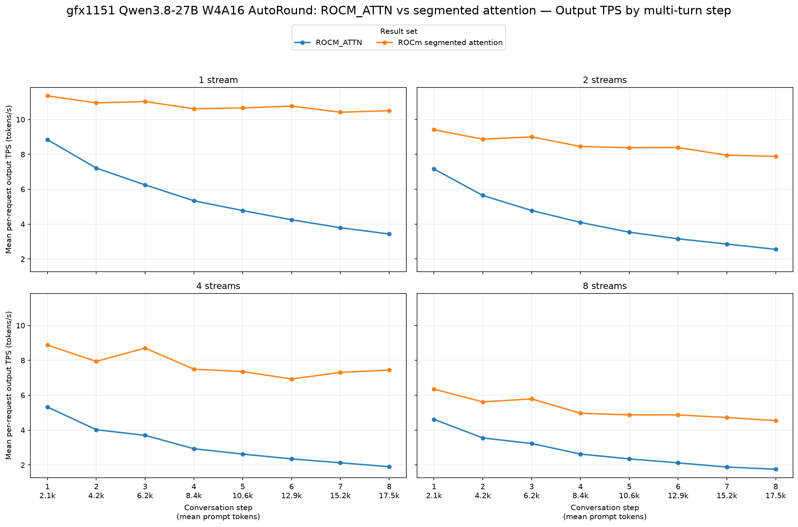
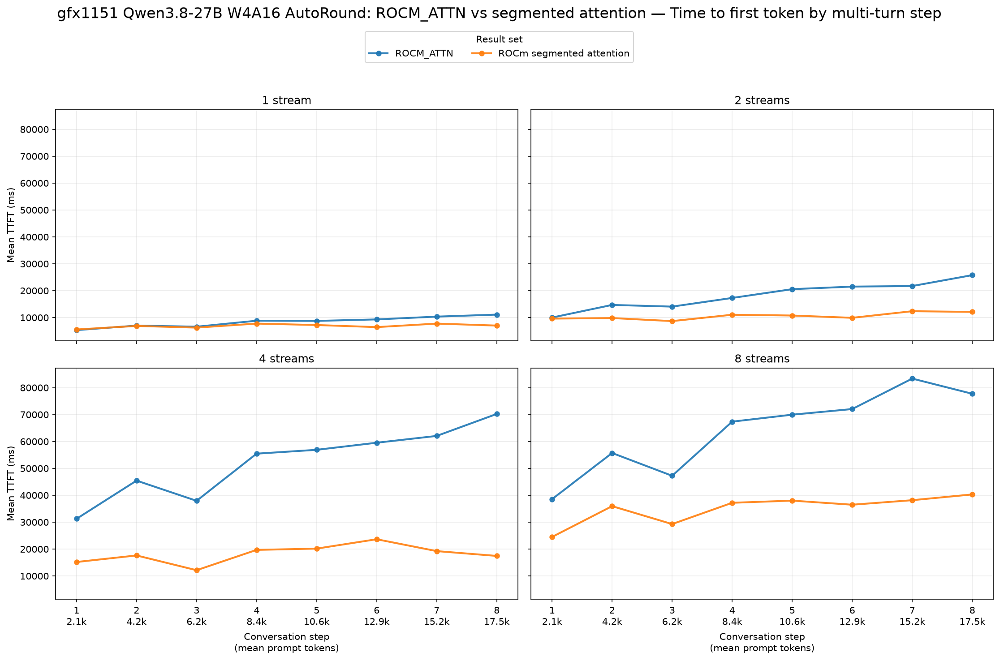
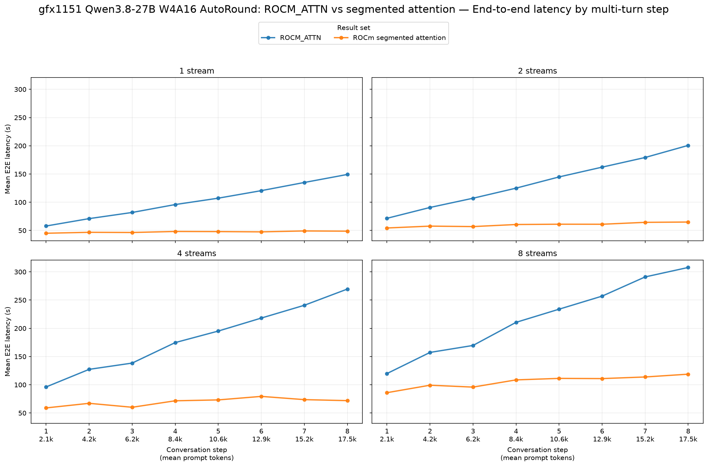

# gfx1151: ROCM_ATTN vs ROCm segmented attention

Baseline: [ROCM_ATTN](../../../../agent-multiturn-benchmarks.json). Candidate: [ROCm segmented attention](../../../../results/gfx1151/qwen3.8-27b-w4a16-autoround/rocm-segmented-attn/agent-multiturn-benchmarks.json). Changes below are baseline → candidate.

## Setup and compatibility

Both GuideLLM 0.7.3 reports use `dbirks/Qwen3.8-27B-W4A16-AutoRound`, the `simple-agent-multiturn-prefix-cache` synthetic workload, 2,048 configured prompt tokens, 512 output tokens, 8 turns, seed `20260715`, and 1/2/4/8 configured streams. Each completed 8/16/32/64 requests at those stream levels, with zero errors or incomplete requests. The backend ports differ (`8000` and `8001`), as expected for separate server runs.

These are end-to-end serving results. Table entries are arithmetic means over **all successful request records**, matching the figures. Output tok/s is mean *per-request* output rate, not aggregate server throughput. Positive tok/s changes and negative TTFT/E2E changes indicate improvement.

| Streams | Output tok/s, baseline → candidate | Output tok/s change | Mean TTFT (ms), baseline → candidate | Mean TTFT (ms) change | Mean E2E (s), baseline → candidate | Mean E2E (s) change |
|---:|---:|---:|---:|---:|---:|---:|
| 1 | 5.49 → 10.79 | **+96.6%** | 8,424 → 6,878 | **−18.4%** | 102.33 → 47.49 | **−53.6%** |
| 2 | 4.22 → 8.54 | **+102.3%** | 18,215 → 10,549 | **−42.1%** | 135.15 → 60.12 | **−55.5%** |
| 4 | 3.12 → 7.76 | **+148.5%** | 52,347 → 18,142 | **−65.3%** | 182.52 → 69.52 | **−61.9%** |
| 8 | 2.77 → 5.22 | **+88.6%** | 63,995 → 34,987 | **−45.3%** | 218.37 → 105.57 | **−51.7%** |

## Reading the result

Compared with ROCM_ATTN, segmented attention has higher per-request output rate and lower mean TTFT and E2E latency at all four configured stream levels. The ROCM_ATTN output rate falls increasingly across the eight turns as prompt length grows, while the segmented rate stays much flatter. The largest TTFT reduction is at four streams.

The workload settings match, but realized prompt lengths differ slightly: mean request prompt tokens are 9,588/9,642/9,671/9,648 for ROCM_ATTN and 9,340/9,565/9,757/9,632 for segmented attention at 1/2/4/8 streams. GuideLLM's measured mean successful-request concurrency is 1.00/2.00/4.00/4.58 for ROCM_ATTN and 1.00/2.00/2.18/4.25 for segmented attention; notably, the four-stream runs did not achieve equal concurrency. The reports also record different Linux and Python versions. These factors limit attribution of the entire gap to the attention backend alone.
