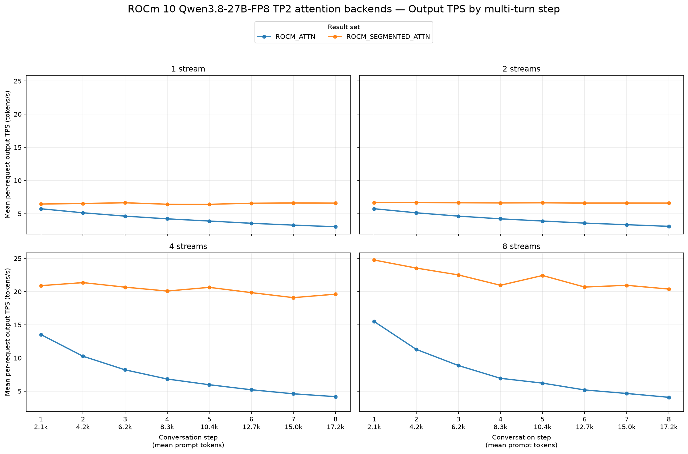
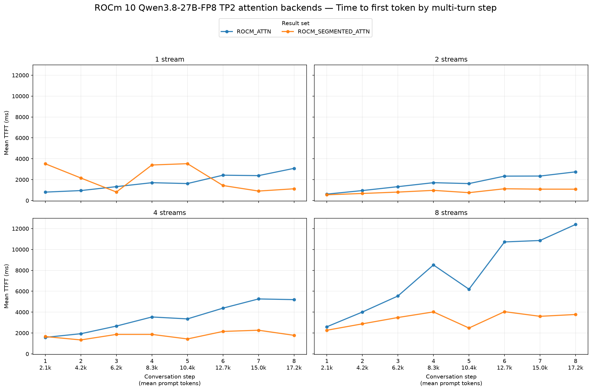
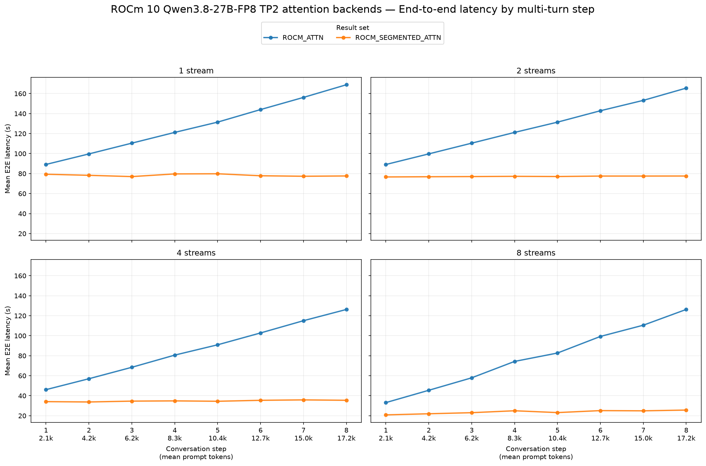

# ROCm 10: ROCM_ATTN vs ROCM_SEGMENTED_ATTN

## Setup and validity

- **Date:** 2026-09-28. **Hardware:** two AMD Radeon AI PRO R9700 GPUs (gfx1201).
- **Image for both runs:** `chefjeff/vllm:rocm10-segmented-gfx11-gfx12` (`sha256:f29345067db16b93e1872757249f0e6dae32676401ec6f3e0a406b349b4b148c`), built from `big-yellow-duck/vllm` branch `perf/rocm-segmented-attn` at `4f208193293dde825c367f760559ba0faa727cfb`.
- **Server:** `Qwen/Qwen3.8-27B-FP8`, tensor parallel size 2, FP8 KV cache, maximum 8 sequences, 8,192 batched tokens, GPU memory utilization 0.92, automatic maximum model length, tool and reasoning parsers as in `run_vllm_rocm10_qwen38.bash`. Only `--attention-backend` differed between runs.
- **Loader change from reference launcher:** both runs used `--load-format safetensors`. The reference script's `fastsafetensors` loader failed at startup with `libamdhip64.so` reporting no GPU, although PyTorch detected both GPUs. The standard loader succeeded.
- **GuideLLM:** version 0.7.3 with [`simple-agent-multiturn-prefix-cache.json`](../../../../benchmarks-configs/simple-agent-multiturn-prefix-cache.json). Both reports have the same 8-turn synthetic-text workload, 2,048 new prompt tokens per turn, 512 output tokens per request, static seed `20260715`, and configured streams 1/2/4/8. Each backend completed 8/16/32/64 requests respectively, with zero errors and zero incomplete requests. Each generated 61,440 output tokens.

Raw reports and logs: [ROCM_ATTN](../../../../results/gfx1201/qwen3.8-27b-fp8/tp2-rocm10-rocm-attn-fp8/agent-multiturn-benchmarks.json) ([benchmark log](../../../../results/gfx1201/qwen3.8-27b-fp8/tp2-rocm10-rocm-attn-fp8/benchmark.log), [server log](../../../../results/gfx1201/qwen3.8-27b-fp8/tp2-rocm10-rocm-attn-fp8/server.log)) and [ROCM_SEGMENTED_ATTN](../../../../results/gfx1201/qwen3.8-27b-fp8/tp2-rocm10-rocm-segmented-attn-fp8/agent-multiturn-benchmarks.json) ([benchmark log](../../../../results/gfx1201/qwen3.8-27b-fp8/tp2-rocm10-rocm-segmented-attn-fp8/benchmark.log), [server log](../../../../results/gfx1201/qwen3.8-27b-fp8/tp2-rocm10-rocm-segmented-attn-fp8/server.log)).

## Request-level results

Baseline → candidate is **ROCM_ATTN → ROCM_SEGMENTED_ATTN**. Values are arithmetic means over *all* `requests.successful` records, using the compare skill's summary helper. Positive output TPS changes and negative TTFT/E2E changes improve performance; improvements are bold.

| Streams | Output tok/s, baseline → candidate | Output tok/s change | Mean TTFT (ms), baseline → candidate | Mean TTFT (ms) change | Mean E2E (s), baseline → candidate | Mean E2E (s) change |
|---:|---:|---:|---:|---:|---:|---:|
| 1 | 4.19 → 6.53 | **+56.0%** | 1,790 → 2,113 | +18.0% | 127.62 → 78.37 | **−38.6%** |
| 2 | 4.21 → 6.63 | **+57.7%** | 1,708 → 884 | **−48.2%** | 126.68 → 77.19 | **−39.1%** |
| 4 | 7.35 → 20.28 | **+176.0%** | 3,488 → 1,794 | **−48.6%** | 85.90 → 34.81 | **−59.5%** |
| 8 | 7.84 → 22.03 | **+181.1%** | 7,604 → 3,317 | **−56.4%** | 78.71 → 23.71 | **−69.9%** |

These are end-to-end serving results, including model execution, scheduling, prefix caching, and HTTP response streaming. They are not isolated attention-kernel timings. The sum of GuideLLM benchmark durations was 5,483.7 s for ROCM_ATTN and 2,688.7 s for ROCM_SEGMENTED_ATTN, a 51.0% reduction for this fixed suite, excluding server startup.

## By conversation turn

Segmented attention keeps per-request output TPS and E2E latency comparatively flat as the mean prompt grows from about 2.1K to 17.2K tokens. ROCM_ATTN slows markedly as the prefix grows, especially at 4 and 8 configured streams. Segmented TTFT is lower at streams 2/4/8 but **18.0% higher at one stream**; its one-stream TTFT plot includes several spikes, and its server logged inference-time Triton JIT compilation. The ROCM_ATTN run also logged an inference-time Triton JIT warning. Treat the one-stream TTFT difference as a cold-run result.

## Interpretation limits

Configured streams were not continuously achieved. GuideLLM's mean successful-request concurrency was 1.00 → 1.00 at configured stream 1, 1.00 → 1.00 at stream 2, 1.72 → 1.42 at stream 4, and 4.15 → 4.28 at stream 8 (ROCM_ATTN → segmented). The higher-stream comparisons therefore reflect this multi-turn scheduler's actual overlap. Both server logs also warn that tuned block-FP8 GEMM configurations for the R9700 are missing, so these are measurements of the image's default GEMM path. This run covers gfx1201 hardware only.
