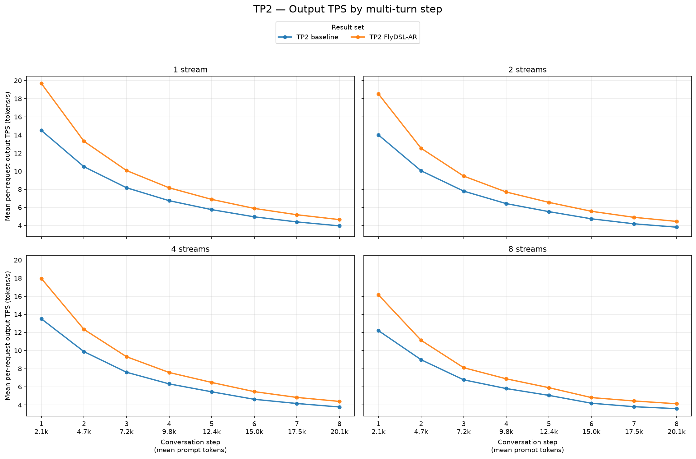
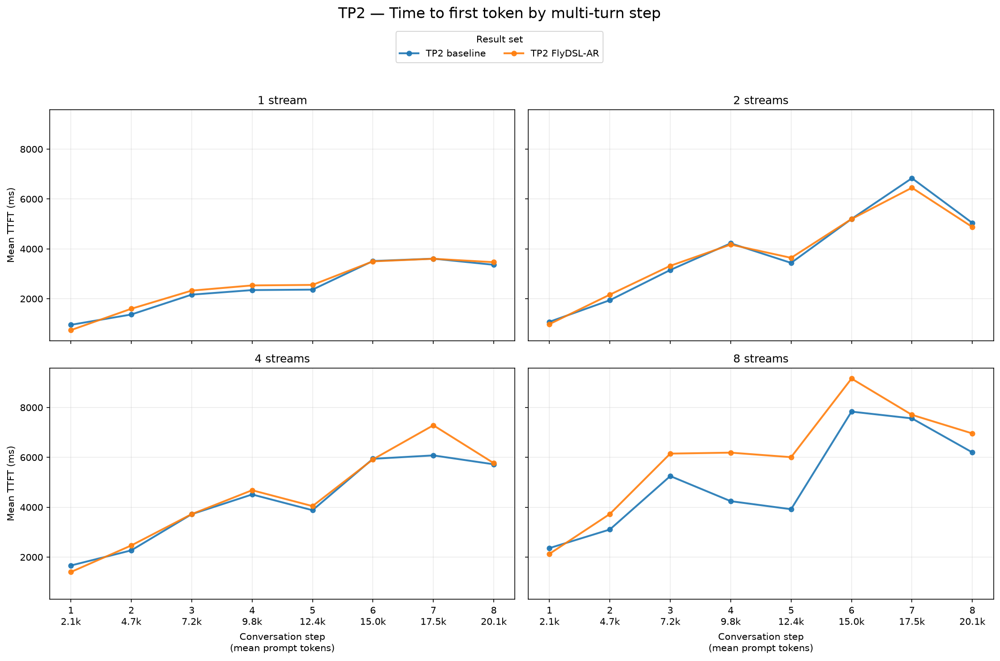
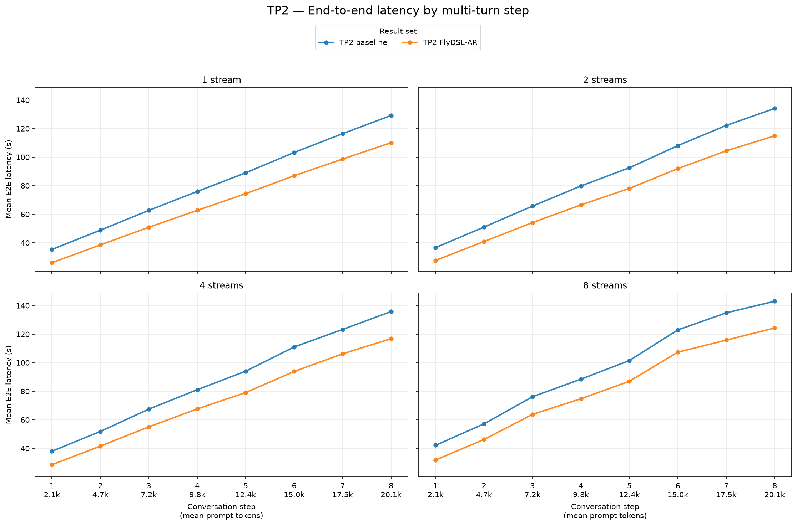
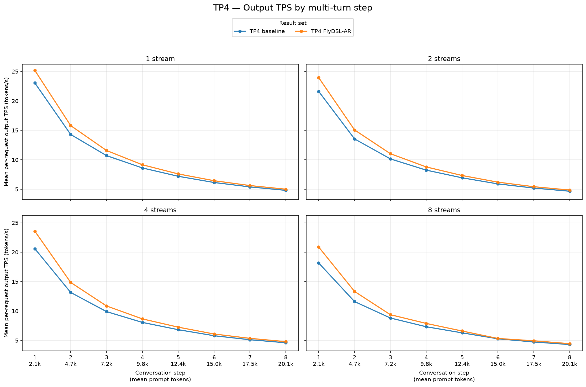
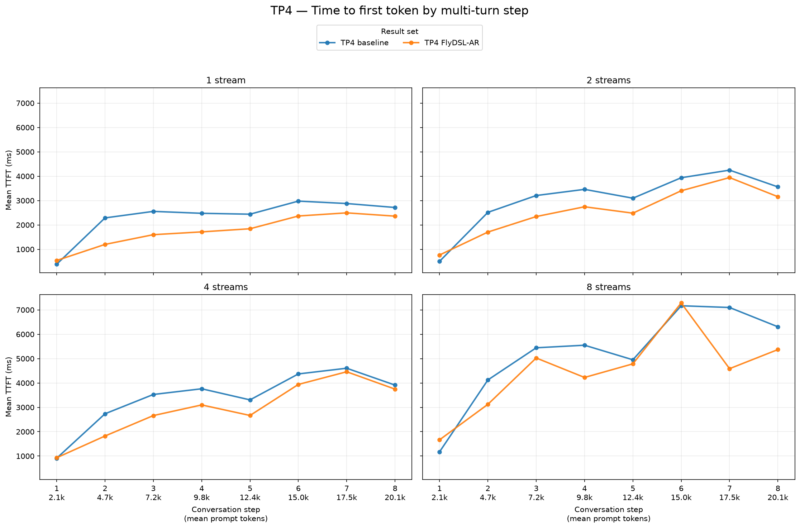
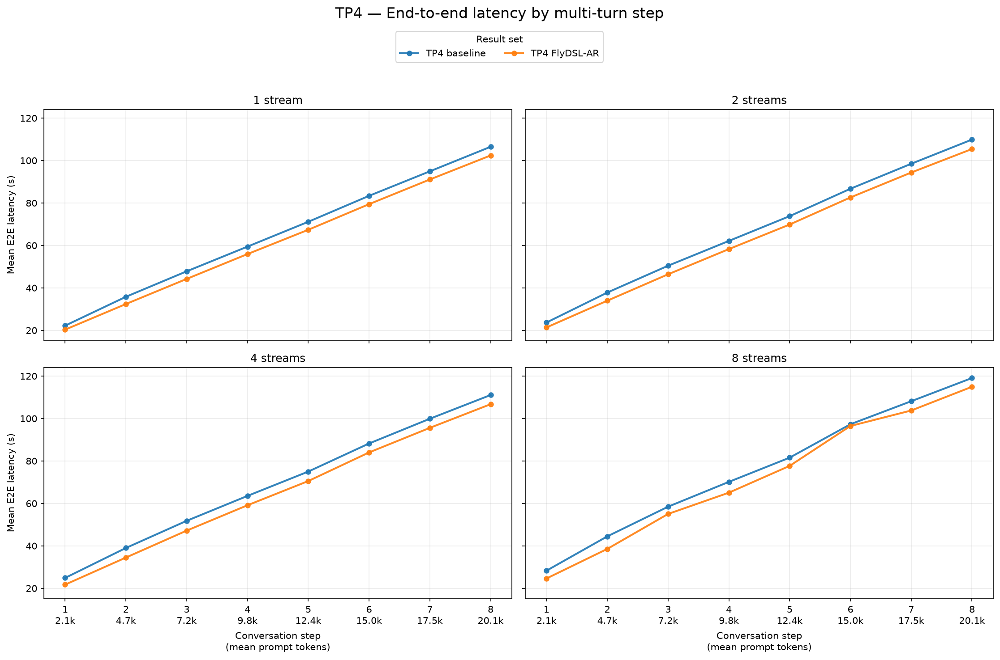

# TP2 vs. TP4 FlyDSL-AR serving results

This report compares the current TP2 and TP4 baseline and FlyDSL-AR GuideLLM
runs for `Qwen/Qwen3.8-27B-FP8` on `gfx1201`. All four runs use the same
eight-turn workload and configured stream levels (1, 2, 4, and 8).

These are end-to-end serving results, not the all-reduce kernel microbenchmarks
reported in [vLLM PR #55917](https://github.com/vllm-project/vllm/pull/55917).

## Aggregate results

The values below are means over all successful request records, matching the
population used by the step-by-step charts. This avoids a mismatched comparison
caused by GuideLLM excluding warmup requests from some run summaries but not
others. Throughput is mean per-request output TPS, not the sum of the individual
request rates. Each value pair is baseline → FlyDSL-AR. Positive TPS changes are
improvements; negative TTFT and E2E changes are improvements.

| TP | Streams | Output tok/s, baseline → FlyDSL-AR | TPS change | Mean TTFT (ms), baseline → FlyDSL-AR | TTFT change | Mean E2E (s), baseline → FlyDSL-AR | E2E change |
|---:|---:|---:|---:|---:|---:|---:|---:|
| 2 | 1 | 7.37 → 9.23 | **+25.2%** | 2,460 → 2,541 | +3.3% | 82.57 → 68.51 | **−17.0%** |
| 2 | 2 | 7.07 → 8.71 | **+23.3%** | 3,863 → 3,851 | **−0.3%** | 86.23 → 72.30 | **−16.1%** |
| 2 | 4 | 6.92 → 8.55 | **+23.6%** | 4,224 → 4,412 | +4.4% | 87.81 → 73.59 | **−16.2%** |
| 2 | 8 | 6.30 → 7.70 | **+22.1%** | 5,060 → 6,004 | +18.7% | 95.79 → 81.39 | **−15.0%** |
| 4 | 1 | 10.03 → 10.80 | **+7.7%** | 2,340 → 1,765 | **−24.6%** | 65.14 → 61.64 | **−5.4%** |
| 4 | 2 | 9.53 → 10.33 | **+8.4%** | 3,066 → 2,568 | **−16.2%** | 67.86 → 64.03 | **−5.6%** |
| 4 | 4 | 9.26 → 10.19 | **+10.0%** | 3,391 → 2,916 | **−14.0%** | 69.17 → 64.92 | **−6.1%** |
| 4 | 8 | 8.32 → 9.18 | **+10.3%** | 5,226 → 4,494 | **−14.0%** | 75.93 → 71.33 | **−6.1%** |

## Step-by-step charts

TP2 and TP4 have separate figures. Each uses four subplots, one for each stream
level, with baseline and FlyDSL-AR as the two lines. The eight points on every
line are the conversation turns, whose prompt sizes grow from approximately
2.1k to 20.1k tokens.

### TP2

### TP4

## Interpretation

- The new TP2 baseline removes the earlier anomalously flat per-turn TPS curve.
  Its output TPS now falls as the prefix grows, from 14.50 to 3.96 tok/s at one
  stream and from 12.20 to 3.59 tok/s at eight streams.
- TP2 FlyDSL-AR improves mean per-request output TPS over the new TP2 baseline
  by 22.1–25.2% and reduces mean E2E latency by 15.0–17.0% across the four
  stream levels.
- Mean TP2 TTFT improves slightly at two streams (-0.3%). It regresses by 3.3%
  at one stream, 4.4% at four streams, and 18.7% at eight streams.
- TP4 FlyDSL-AR improves mean per-request output TPS by 7.7–10.3%, TTFT by
  14.0–24.6%, and E2E latency by 5.4–6.1% across all four stream levels.
- TP4 FlyDSL-AR has lower mean TTFT and E2E latency than TP2 FlyDSL-AR at every
  configured stream level in these runs.

## Source data

- [TP2 baseline](tp2-baseline/agent-multiturn-benchmarks.json)
- [TP2 FlyDSL-AR](tp2-flydslar/agent-multiturn-benchmarks.json)
- [TP4 baseline](tp4-baseline/agent-multiturn-benchmarks.json)
- [TP4 FlyDSL-AR](tp4-flydslar/agent-multiturn-benchmarks.json)
