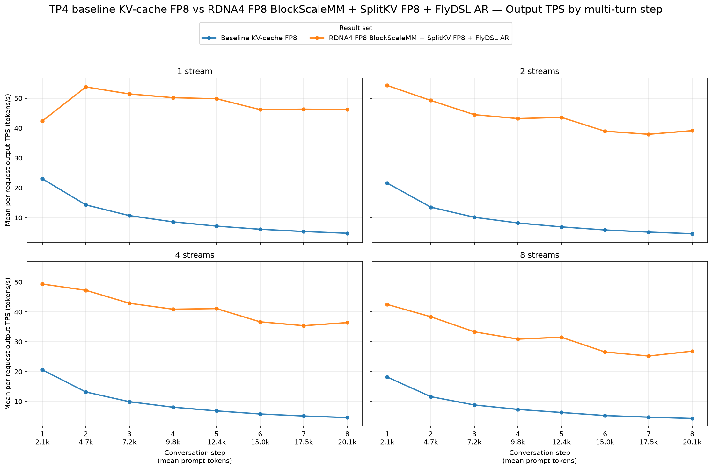
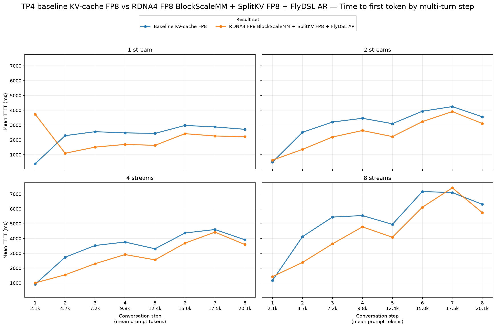
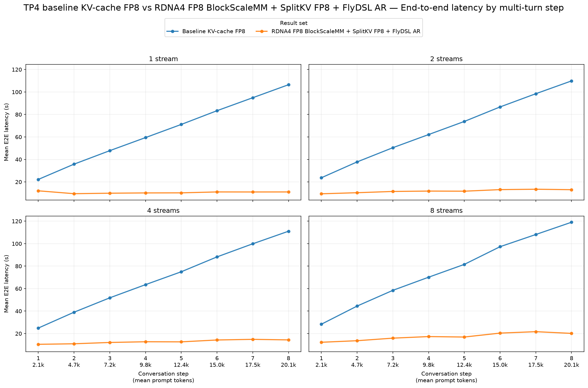

# TP4 baseline KV-cache FP8 vs. RDNA4 FP8 BlockScaleMM + SplitKV FP8 + FlyDSL AR

This report compares the TP4 baseline KV-cache-FP8 run with
`tp4-rdna4fp8blockscalemm-splitkvfp8-flydslar` for
`Qwen/Qwen3.8-27B-FP8` on `gfx1201`.

## Setup and compatibility

The workload-defining settings match:

- Streams: 1, 2, 4, and 8
- Synthetic prompt: 2,048 tokens per turn
- Output: 512 tokens per turn
- Turns per conversation: 8
- Seed: `20260715`
- Successful requests: 8, 16, 32, and 64; no errored or incomplete requests

The candidate explicitly configured one warmup request, while the baseline used
GuideLLM's default `prefer_duration` warmup setting. The table and charts use
means over every `requests.successful` record, rather than GuideLLM's benchmark
summary metrics, so they compare the same request population definition. The
runs also used different Linux kernel revisions (`7.1.8-ogc1.1` and
`7.2.1-ogc4.1`), which is a minor environmental caveat.

## Aggregate results

Each value pair is baseline → candidate. Positive TPS changes improve
performance; negative TTFT and E2E changes improve performance.

| Streams | Output tok/s, baseline → candidate | TPS change | Mean TTFT (ms), baseline → candidate | TTFT change | Mean E2E (s), baseline → candidate | E2E change |
|---:|---:|---:|---:|---:|---:|---:|
| 1 | 10.03 → 48.30 | **+381.7%** | 2,340 → 2,074 | **−11.4%** | 65.14 → 10.65 | **−83.6%** |
| 2 | 9.53 → 43.87 | **+360.2%** | 3,066 → 2,414 | **−21.3%** | 67.86 → 11.83 | **−82.6%** |
| 4 | 9.26 → 41.23 | **+345.0%** | 3,391 → 2,754 | **−18.8%** | 69.17 → 12.79 | **−81.5%** |
| 8 | 8.32 → 31.89 | **+283.3%** | 5,226 → 4,449 | **−14.9%** | 75.93 → 17.29 | **−77.2%** |

## Step-by-step charts

Each figure has one subplot per stream level and compares the two cases across
the eight conversation turns, as mean prompt size grows from about 2.1k to
20.1k tokens.

## Interpretation

- The candidate improves mean per-request output TPS at every stream level by
  283.3–381.7%. The advantage remains substantial as concurrency rises, though
  the percentage gain narrows at eight streams.
- Mean E2E latency improves at every stream level by 77.2–83.6%.
- Mean TTFT improves at every stream level by 11.4–21.3%. The per-turn chart
  shows isolated regressions at the first turn for one and eight streams and at
  the seventh turn for eight streams, but the aggregate result remains better.
- These are end-to-end serving results for the combined BlockScaleMM, SplitKV
  FP8, and FlyDSL all-reduce configuration, not isolated kernel speedups.

## Source data

- [TP4 baseline KV-cache FP8](tp4-baseline/agent-multiturn-benchmarks.json)
- [TP4 RDNA4 FP8 BlockScaleMM + SplitKV FP8 + FlyDSL AR](../../../plots/gfx1201/qwen3.8-27b-fp8/tp4-rdna4fp8blockscalemm-splitkvfp8-flydslar/agent-multiturn-benchmarks.json)
