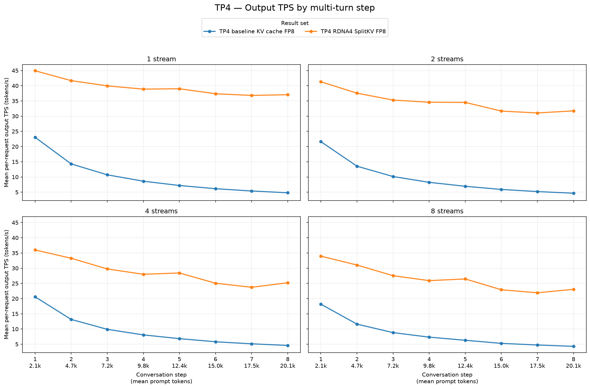
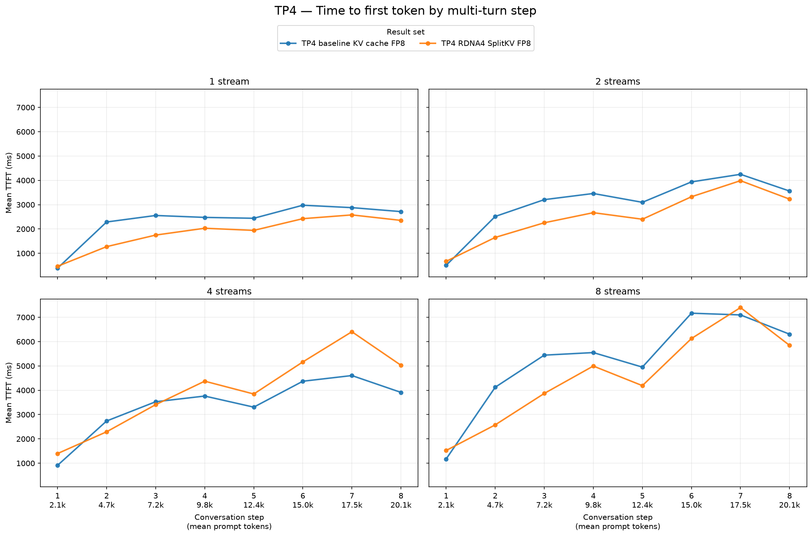
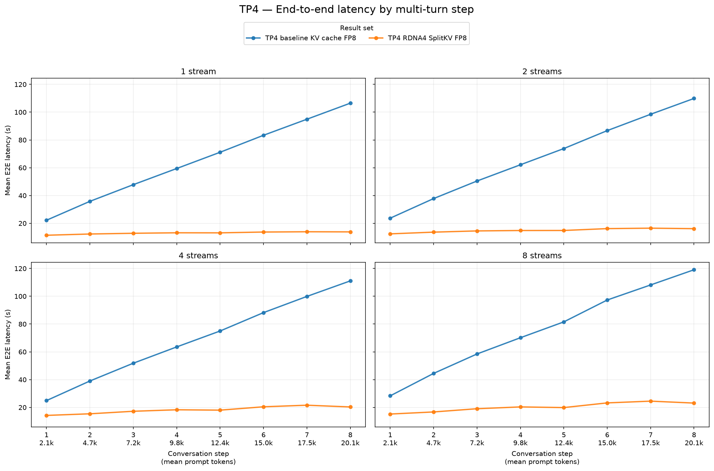

# TP4 baseline KV-cache FP8 vs. RDNA4 SplitKV FP8

This report compares the TP4 baseline KV-cache-FP8 run with
`tp4-rdna4splitkv_fp8` for `Qwen/Qwen3.8-27B-FP8` on `gfx1201`.

Both runs use the same GuideLLM workload:

- Streams: 1, 2, 4, and 8
- Synthetic prompt: 2,048 tokens per turn
- Output: 512 tokens per turn
- Turns per conversation: 8
- Seed: `20260715`
- Successful requests: 8, 16, 32, and 64; no request errors

## Aggregate results

The values below are means over all successful request records, matching the
population used by the step-by-step charts. This avoids mismatched warmup
exclusion between GuideLLM run summaries. Throughput is mean per-request output
TPS. Each value pair is baseline → RDNA4 SplitKV FP8. Positive TPS changes are
improvements; negative TTFT and E2E changes are improvements.

| Streams | Output tok/s, baseline → SplitKV FP8 | TPS change | Mean TTFT (ms), baseline → SplitKV FP8 | TTFT change | Mean E2E (s), baseline → SplitKV FP8 | E2E change |
|---:|---:|---:|---:|---:|---:|---:|
| 1 | 10.03 → 39.46 | **+293.5%** | 2,340 → 1,853 | **−20.8%** | 65.14 → 13.03 | **−80.0%** |
| 2 | 9.53 → 34.71 | **+264.1%** | 3,066 → 2,524 | **−17.7%** | 67.86 → 14.87 | **−78.1%** |
| 4 | 9.26 → 28.68 | **+209.6%** | 3,391 → 3,989 | +17.6% | 69.17 → 18.18 | **−73.7%** |
| 8 | 8.32 → 26.60 | **+219.7%** | 5,226 → 4,566 | **−12.6%** | 75.93 → 20.25 | **−73.3%** |

## Step-by-step charts

Each figure has four subplots, one for each configured stream level. Every
subplot compares baseline with RDNA4 SplitKV FP8 over the eight conversation
turns, whose prompt sizes grow from approximately 2.1k to 20.1k tokens.

## Interpretation

- RDNA4 SplitKV FP8 improves mean per-request output TPS at every configured
  stream level by 209.6–293.5%.
- Mean E2E latency improves at every stream level by 73.3–80.0%.
- Mean TTFT improves by 12.6–20.8% at streams 1, 2, and 8, but regresses by
  17.6% at four streams.
- The unusually large TPS and E2E differences are present throughout the
  request-level results. They should still be interpreted as an end-to-end
  serving comparison, not as an isolated SplitKV kernel speedup.

## Source data

- [TP4 baseline KV-cache FP8](tp4-baseline/agent-multiturn-benchmarks.json)
- [TP4 RDNA4 SplitKV FP8](tp4-rdna4splitkv_fp8/agent-multiturn-benchmarks.json)
