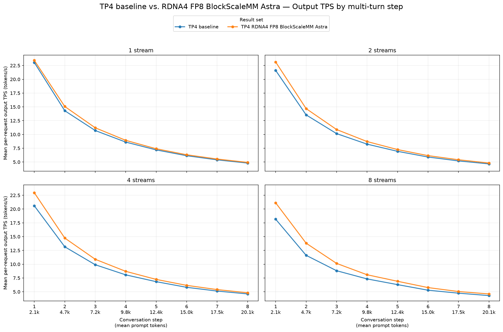
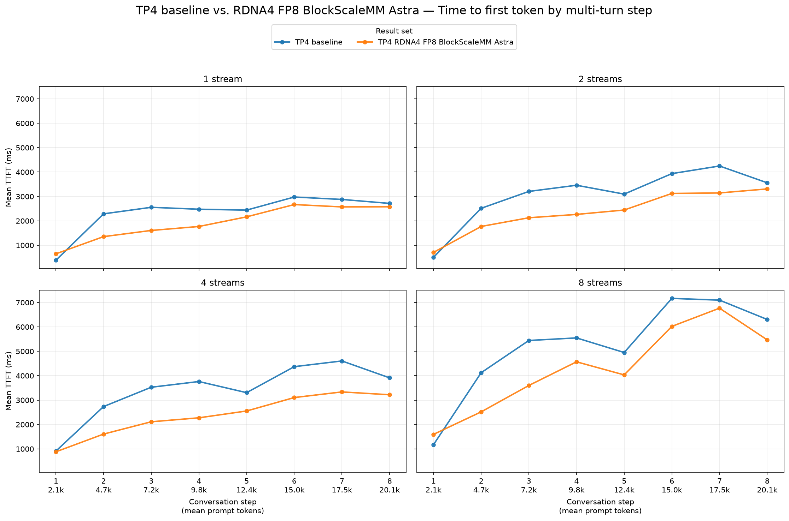
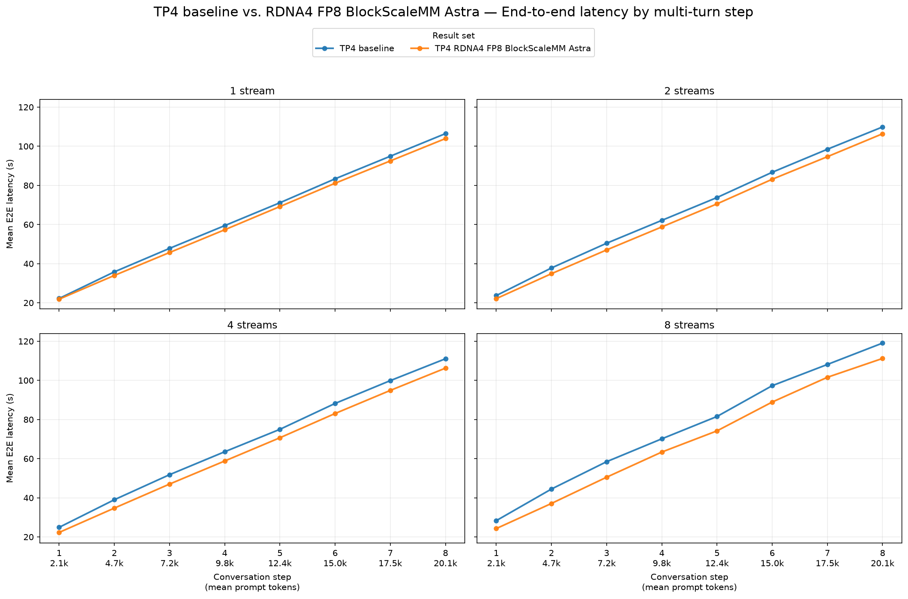

# TP4 baseline vs. RDNA4 FP8 BlockScaleMM Astra

This report compares `tp4-baseline` with
`tp4-rdna4fp8blockscalemm-astra` for `Qwen/Qwen3.8-27B-FP8` on
`gfx1201`.

Both runs use the same GuideLLM workload:

- Streams: 1, 2, 4, and 8
- Synthetic prompt: 2,048 tokens per turn
- Output: 512 tokens per turn
- Turns per conversation: 8
- Seed: `20260715`
- Successful requests: 8, 16, 32, and 64; no request errors or incomplete
  requests

## Aggregate results

The values below are means over all successful request records, matching the
population used by the step-by-step charts. Throughput is mean per-request
output TPS. Each value pair is baseline → RDNA4 FP8 BlockScaleMM Astra.
Positive TPS changes are improvements; negative TTFT and E2E changes are
improvements.

| Streams | Output tok/s, baseline → candidate | TPS change | Mean TTFT (ms), baseline → candidate | TTFT change | Mean E2E (s), baseline → candidate | E2E change |
|---:|---:|---:|---:|---:|---:|---:|
| 1 | 10.03 → 10.35 | **+3.2%** | 2,340 → 1,921 | **−17.9%** | 65.14 → 63.20 | **−3.0%** |
| 2 | 9.53 → 10.13 | **+6.3%** | 3,066 → 2,362 | **−23.0%** | 67.86 → 64.69 | **−4.7%** |
| 4 | 9.26 → 10.12 | **+9.2%** | 3,391 → 2,386 | **−29.6%** | 69.17 → 64.72 | **−6.4%** |
| 8 | 8.32 → 9.44 | **+13.4%** | 5,226 → 4,322 | **−17.3%** | 75.93 → 68.90 | **−9.3%** |

## Step-by-step charts

Each figure has four subplots, one for each configured stream level. Every
subplot compares baseline with RDNA4 FP8 BlockScaleMM Astra over the eight
conversation turns, whose prompt sizes grow from approximately 2.1k to 20.1k
tokens.

## Interpretation

- RDNA4 FP8 BlockScaleMM Astra improves mean per-request output TPS at every
  stream level, from 3.2% at one stream to 13.4% at eight streams. The gain
  grows with concurrency.
- Mean TTFT improves at every stream level by 17.3–29.6%. The largest reduction
  is at the four-stream target.
- Mean E2E latency improves at every stream level by 3.0–9.3%, again with the
  largest gain at the eight-stream target.
- Achieved concurrency is closely matched between the two runs, but both
  plateau near two active requests at the four-stream target and near four at
  the eight-stream target. The results support a matched-serving comparison,
  but not full scaling to the requested concurrency.
- These are end-to-end serving results and should not be interpreted as an
  isolated GEMM-kernel speedup.

## Source data

- [TP4 baseline](tp4-baseline/agent-multiturn-benchmarks.json)
- [TP4 RDNA4 FP8 BlockScaleMM Astra](tp4-rdna4fp8blockscalemm-astra/agent-multiturn-benchmarks.json)
