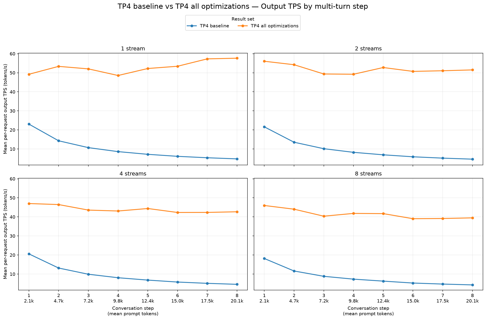
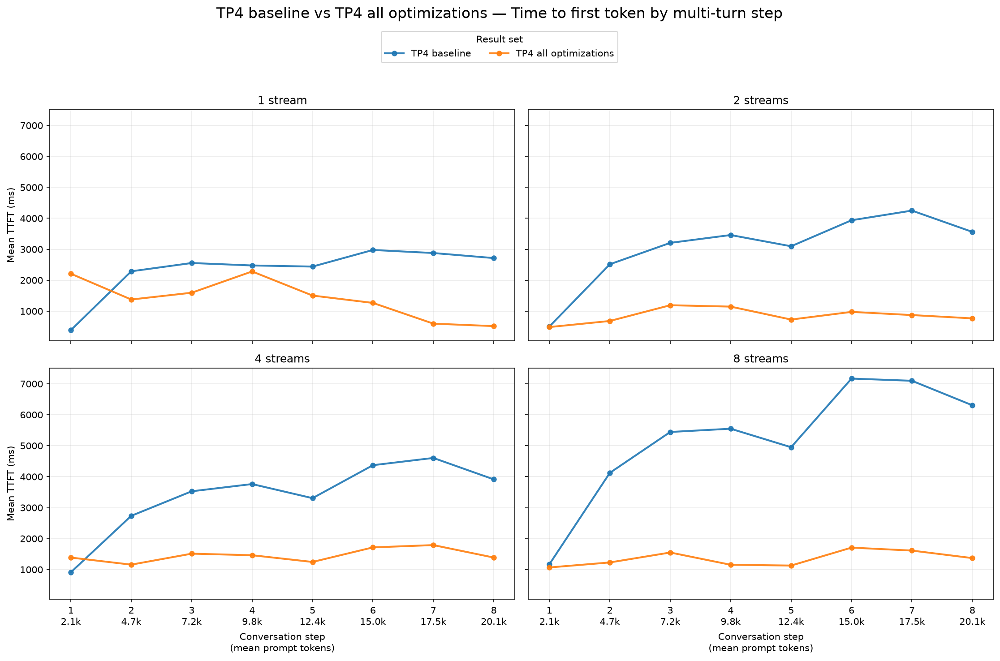
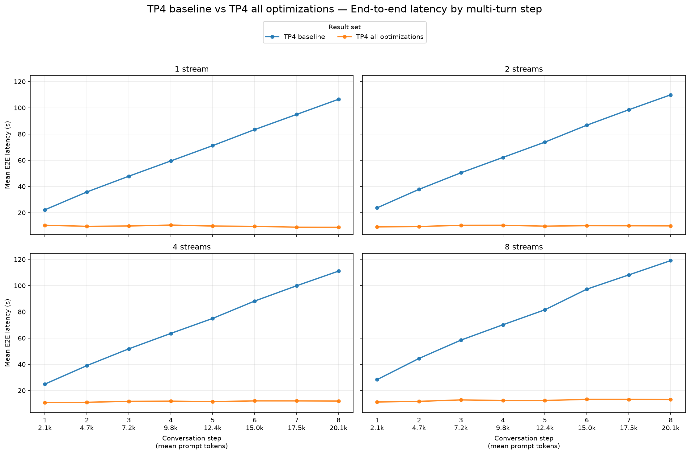
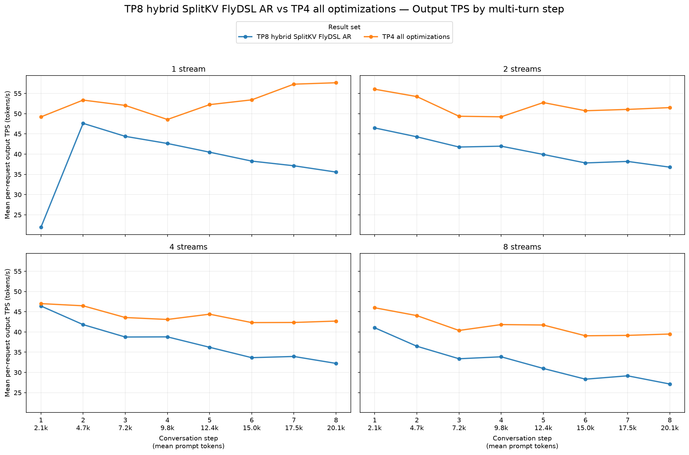
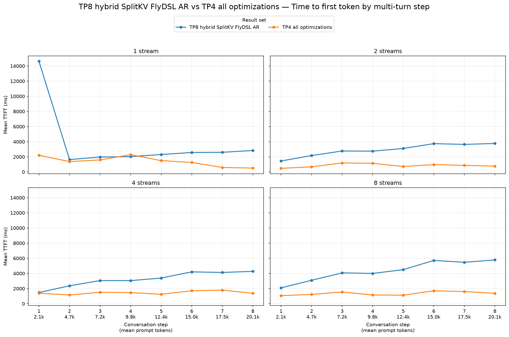
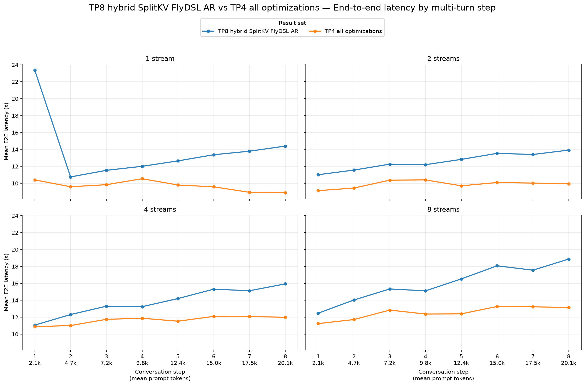

# TP4 all optimizations: GuideLLM comparisons

The tables use arithmetic means over all successful requests. Positive output TPS changes and negative TTFT or E2E changes indicate improvement. These are end-to-end serving measurements, not isolated kernel timings.

All three reports use `Qwen/Qwen3.8-27B-FP8` and the `simple-agent-multiturn-prefix-cache` workload: 2,048 prompt tokens, 512 output tokens, eight turns, seed `20260715`, and configured streams 1, 2, 4, and 8. At each stream level, every report has 8, 16, 32, and 64 successful requests respectively, with zero errored or incomplete requests. The TP4 baseline has no warmup; the new TP4 and TP8 reports request one warmup. The TP8 report also uses a remote HTTP target while the other reports use localhost. These differences may affect the comparison, especially TTFT.

## TP4 baseline → TP4 all optimizations

| Streams | Output tok/s, baseline → candidate | Output tok/s change | Mean TTFT (ms), baseline → candidate | Mean TTFT (ms) change | Mean E2E (s), baseline → candidate | Mean E2E (s) change |
|---:|---:|---:|---:|---:|---:|---:|
| 1 | 10.03 → 52.96 | **+428.2%** | 2,340 → 1,419 | **−39.4%** | 65.14 → 9.70 | **−85.1%** |
| 2 | 9.53 → 51.85 | **+444.0%** | 3,066 → 857 | **−72.0%** | 67.86 → 9.89 | **−85.4%** |
| 4 | 9.26 → 43.98 | **+374.8%** | 3,391 → 1,457 | **−57.0%** | 69.17 → 11.66 | **−83.1%** |
| 8 | 8.32 → 41.45 | **+398.2%** | 5,226 → 1,353 | **−74.1%** | 75.93 → 12.53 | **−83.5%** |

Mean output TPS increases 374.8–444.0% at every stream setting, while mean E2E latency falls 83–85%. The new run also has lower mean TTFT at every stream setting. The TPS plots show that the largest separation occurs at later turns, where the baseline's TPS declines sharply.

## TP8 hybrid SplitKV FlyDSL AR → TP4 all optimizations

| Streams | Output tok/s, baseline → candidate | Output tok/s change | Mean TTFT (ms), baseline → candidate | Mean TTFT (ms) change | Mean E2E (s), baseline → candidate | Mean E2E (s) change |
|---:|---:|---:|---:|---:|---:|---:|
| 1 | 38.50 → 52.96 | **+37.6%** | 3,824 → 1,419 | **−62.9%** | 13.98 → 9.70 | **−30.6%** |
| 2 | 40.89 → 51.85 | **+26.8%** | 2,927 → 857 | **−70.7%** | 12.59 → 9.89 | **−21.5%** |
| 4 | 37.72 → 43.98 | **+16.6%** | 3,245 → 1,457 | **−55.1%** | 13.82 → 11.66 | **−15.6%** |
| 8 | 32.54 → 41.45 | **+27.4%** | 4,342 → 1,353 | **−68.9%** | 16.00 → 12.53 | **−21.7%** |

The TP4 run has 16.6–37.6% higher mean per-request output TPS and 15.6–30.6% lower mean E2E latency across the four stream settings. Mean TTFT is 55.1–70.7% lower. The TP8 run's first request at one stream has unusually high TTFT and low TPS, which contributes to its one-stream averages; later turns still favor the TP4 run.

